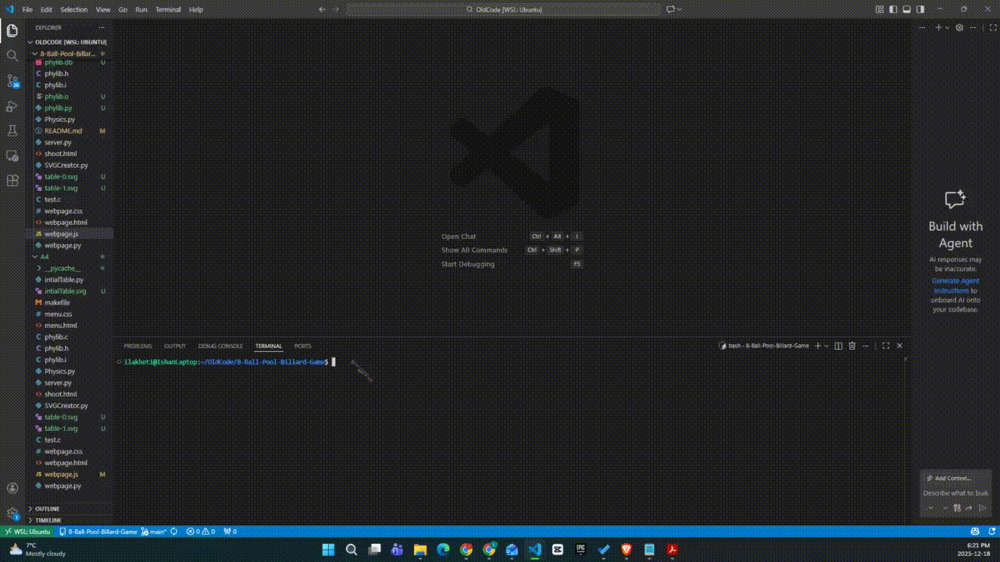
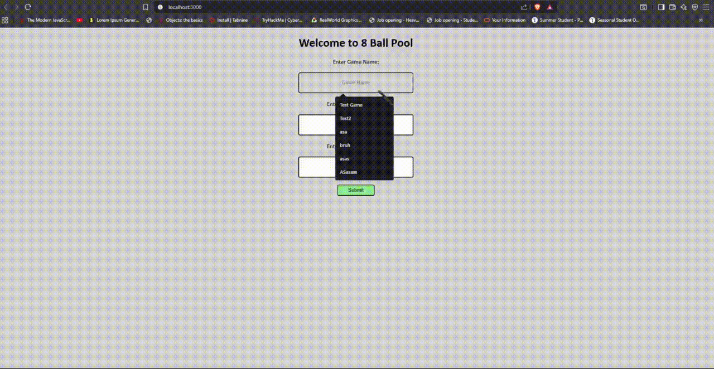

# Full-Stack Pool Billiards Game

A full‑stack 8‑Ball Pool (Billiards) game that combines low‑level physics simulation library built in C with a Python backend, SQLite database, and an interactive JavaScript/HTML/CSS frontend. This game simulates realistic ball physics, and renders gameplay frame‑by‑frame using SVG.

---

## Project Overview

This project is split into three major layers:

1. **Physics Engine/Library (C)**
   - A C library that has realistic billiards physics such as collisions, rolling motion, cushions, holes, friction, velocity, acceleration, and more.

2. **Backend/Server & Game Logic (Python)**
   - Bridges the C physics engine to Python, manages game rules, objects, and state, stores simulation frames in SQLite, and generates SVG frames. Also handles Post Requests, Get Requests, and other server logic.

3. **Frontend (JavaScript + HTML/CSS)**
   - Displays the UI to the user, handles user input, sends shot data to the backend, and animates returned SVG frames in the browser.

---

## How to Run
## Pre-Requiste
- Make sure to be on a UNIX(Linux, WSL, etc) type of device as this code only works on these platforms. In future updates a Windows Compatible version will be added
---
1. Clone the Repoisitory
```bash
git clone https://github.com/SlyIshan27/8-Ball-Pool-Billard-Game.git
cd 8-Ball-Pool-Billard-Game
```
2. **Compile the C library** (phylib)
```bash
make
```
- This will create all the dependencies, tools, and libraries needed for the physics of the game.
3. **Start the backend server**:

```bash
python3 webpage.py <PORT>
```

4. **Open http://localhost:PORTNUMBER on your browser!**

---
## Demo
### Running the server

### Starting the game

### Taking Shots (Sorry for poor quality of the GIF)
![Demo3]
---

## Technologies Used

* **C** – For Physics and Calculation Library/Engine
* **Python** – Backend server, Game Management, database logic, and SVG generation
* **SQLite** – Persistent storage of tables, balls, shots, and games
* **JavaScript** – Frontend interaction & animation
* **HTML/CSS** – UI and layout
* **SVG** – Rendering the pool table and balls frame by frame

---

## Physics Library (C)

The C portion of the project is a full physics simulation library responsible for:

### Features

* Still balls, rolling balls, holes, and cushions
* Collision detection and response (ball–ball, ball–cushion, ball–hole)
* Rolling motion with drag and stopping conditions
* Velocity and Acceleration Calculations
* Table segmentation for time‑based simulation
* And More


### Key Functions

| Function                  | Purpose                               |
| ------------------------- | ------------------------------------- |
| `phylib_new_still_ball`   | Create a stationary ball              |
| `phylib_new_rolling_ball` | Create a moving ball                  |
| `phylib_roll`             | Advance ball motion                   |
| `phylib_bounce`           | Handle collisions                     |
| `phylib_segment`          | Simulate until next collision or stop |
| `phylib_distance`         | Collision distance checking           |
| `phylib_stopped`          | Convert rolling → still               |
| `phylib_copy_table`       | Deep copy of a table                  |

This engine is exposed to Python via bindings and used as the authoritative physics model.


## Python Physics Wrapper, Game Management & SVG System

The Python layer wraps the C engine and extends it with object‑oriented abstractions, SVG rendering, and **database persistence.

### SVG Rendering

Each object implements an `svg()` method:

* `StillBall.svg()`
* `RollingBall.svg()`
* `Hole.svg()`
* `HCushion.svg()`
* `VCushion.svg()`

The `Table.svg()` method assembles a full SVG frame using:

* SVG header + footer
* Per‑object SVG fragments

This allows the frame‑by‑frame animation of shots.

---

## Database Architecture (SQLite)

All game state is persisted to `phylib.db`.

### 📦 Tables

| Table       | Description               |
| ----------- | ------------------------- |
| `Game`      | Stores game name          |
| `Player`    | Players per game          |
| `Shot`      | Each shot taken           |
| `TTable`    | Table states over time    |
| `Ball`      | Ball position & velocity  |
| `BallTable` | Ball ↔ Table relationship |
| `TableShot` | Table ↔ Shot relationship |

Each shot produces **hundreds of table frames**, enabling replay and animation.

---

## Game Logic

The `Game` class orchestrates gameplay:

### Shooting Pipeline

1. Identify cue ball
2. Apply initial velocity
3. Run physics segments
4. Generate frame tables using `roll()`
5. Write every frame to SQLite
6. Return shot ID


---

## Backend Server

* Built using Python’s `http.server`
* Accepts POST requests for:

  * Player names
  * Shot velocities/User input of the shots
* Returns:

  * Combined SVG frames (delimited)
  * Game state updates

The server dynamically generates SVGs per shot and streams them to the frontend.

---

## Frontend

* Captures mouse input for shot direction and power
* Sends velocity vectors to backend
* Animates SVG frames sequentially
* Handles turn logic and game flow

---


## Key Highlights

* Realistic physics written entirely in C
* Python bindings for clean OOP interaction
* Frame‑accurate SVG animation
* Persistent replayable game states
* Full‑stack architecture from physics → UI

---

## Author

Ishan Lakhotia


---
